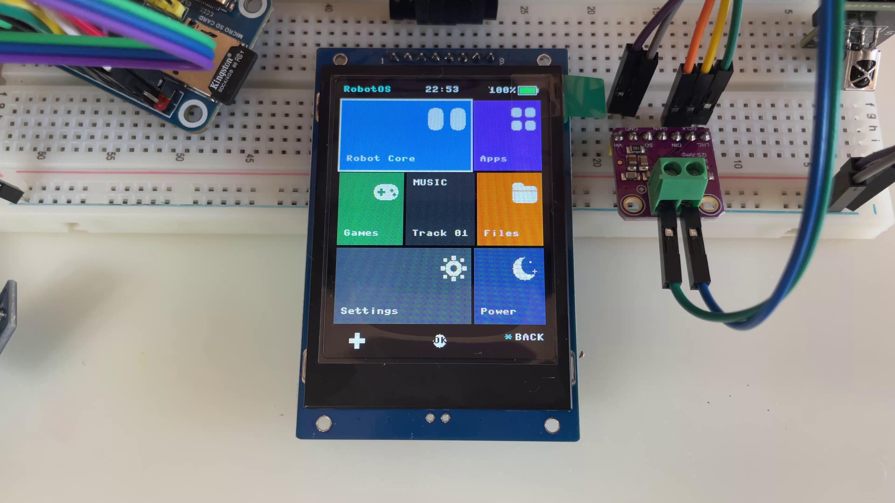

# 🤖 RobotOS v1.0

<p align="center">
  
  
  
  
  
</p>

<p align="center">
  <b>Легковесная операционная система для портативного робота и микроконтроллера с интерфейсом в стиле плиток Windows Phone (Metro UI).</b><br>
  Работает на двухъядерном чипе <b>Raspberry Pi RP2350</b> (ARM Cortex-M33 @ 150 МГц) под управлением MicroPython.
</p>

---

## 📸 Галерея и Демонстрация

<p align="center">
  
</p>

### 🎬 Видео работы на YouTube
[](https://www.youtube.com/watch?v=DiNOH45_jCI)
*(Кликните по картинке выше для перехода к просмотру видео)*

---

## ✨ Ключевые возможности

* **Metro UI (Windows Phone):** 7 асимметричных тайлов, автономный 3D-флип (Live Tiles) с выводом живых статусов (мимика, метеоданные).
* **Аппаратный ввод:**
  * Полноценная клавиатура **PS/2**, работающая через **PIO**.
  * Инфракрасный пульт **NEC IR**.
* **Hi-Fi звук:** Вывод 16-битного звука через аппаратную шину **I2S DAC** (PCM 22050 / 44100 Гц).
* **Сенсорный хаб:** Опрос датчика климата **DHT22** (температура/влажность) и оптического люксметра **BH1750** (I2C).
* **Управление моторикой:** 3 независимых PWM-канала для сервоприводов с интерфейсом калибровки.
* **Встроенные приложения:** Игры (Arkanoid, Cyber-Snake, Doom-Lite), галерея 24-bit BMP, аудиоплеер WAV, блокнот и файловый менеджер.

---

## 🔌 Схема подключения (Pinout)

### 1. Дисплей 2.4" TFT IPS (ST7789, SPI0)
| Пин Дисплея | Пин RP2350 | Назначение |
|:---:|:---:|:---|
| **SCL / SCK** | `GP18` | SPI0 Clock |
| **SDA / MOSI** | `GP19` | SPI0 TX (Data) |
| **DC** | `GP8` | Data / Command |
| **RES / RST** | `GP9` | Reset |
| **CS** | `GP20` | Chip Select |
| **BLK / BL** | `GP21` | Регулировка яркости (PWM) |
| **VCC / GND** | `3.3V` / `GND` | Питание дисплея |

### 2. Звуковой ЦАП I2S (I2S0)
| Пин I2S платы | Пин RP2350 | Назначение |
|:---:|:---:|:---|
| **BCLK / SCK** | `GP10` | Bit Clock |
| **LRCK / WS** | `GP11` | Word Select (Left/Right Channel) |
| **DIN / SD** | `GP12` | Serial Data |
| **VCC / GND** | `3.3V` / `GND` | Питание модуля ЦАП |

### 3. Датчики и устройства ввода
| Устройство | Пин RP2350 | Интерфейс / Описание |
|:---|:---:|:---|
| **DHT22 (AM2302)** | `GP13` | 1-Wire Data (Климат) |
| **BH1750 (SDA)** | `GP4` | I2C0 SDA (Освещенность) |
| **BH1750 (SCL)** | `GP5` | I2C0 SCL (Освещенность) |
| **PS/2 Keyboard Clock** | `GP14` | PIO Clock |
| **PS/2 Keyboard Data** | `GP15` | PIO Data |
| **ИК-приемник (NEC)** | `GP3` | Signal Data |

### 4. Сервоприводы (ШИМ)
| Привод | Пин RP2350 | Примечание |
|:---|:---:|:---|
| **Серво 1 (Голова/Шея)** | `GP0` | PWM сигнал (Питание **строго 5V**) |
| **Серво 2 (Рука L)** | `GP1` | PWM сигнал (Питание **строго 5V**) |
| **Серво 3 (Рука R)** | `GP2` | PWM сигнал (Питание **строго 5V**) |

---

## 🎮 Коды пульта ДУ (NEC Protocol)

| Кнопка | Код (HEX) | Кнопка | Код (HEX) |
|:---:|:---:|:---:|:---:|
| **UP** | `0x31` | **KEY 1** | `0x8B` |
| **DOWN** | `0xA5` | **KEY 2** | `0x8D` |
| **LEFT** | `0x11` | **KEY 3** | `0x8F` |
| **RIGHT** | `0xB5` | **KEY 4** | `0x89` |
| **OK / ENTER** | `0x39` | **KEY 5** | `0x81` |
| **\* (BACK)** | `0x2D` | **KEY 6** | `0x87` |
| **\# (BACK)** | `0x1B` | **KEY 7** | `0x0F` |
| **KEY 0** | `0x33` | **KEY 8** | `0x2B` |
| — | — | **KEY 9** | `0x13` |

---

## 📂 Структура репозитория

```text
├── lib/                     # Аппаратные драйверы
│   ├── st7789.py            # Драйвер SPI IPS дисплея
│   ├── sdcard.py            # Драйвер работы с MicroSD (SPI)
│   ├── ps2.py               # PIO-драйвер клавиатуры PS/2
│   ├── ir_rx.py             # Базовый ИК-ресивер
│   └── nec.py               # Декодер протокола NEC
├── app_eyes.py              # Векторная мимика глаз робота (9 эмоций)
├── app_weather.py           # Погодная станция (DHT22 + BH1750)
├── app_player.py            # I2S аудиоплеер (WAV)
├── app_gallery.py           # Просмотрщик картинок (BMP 240x320)
├── app_editor.py            # Текстовый редактор
├── app_files.py             # Файловый браузер
├── app_arkanoid.py          # Игра Arkanoid
├── app_snake.py             # Игра Cyber-Snake
├── app_doom.py              # Игра Doom-lite
├── app_servo_test.py        # Калибровка и тест сервоприводов
├── app_settings.py          # Настройки (яркость, звук, RTC)
├── app_sleep.py             # Модуль энергосбережения
├── bios.py                  # POST-проверка и экран загрузки
├── gui.py                   # Оболочка Windows Phone Metro UI
├── input_mgr.py             # Унифицированный менеджер ввода (IR + PS/2)
└── main.py                  # Точка входа в систему
```

---

## 🚀 Быстрый старт и установка

### 1. Прошивка MicroPython (если не прошит под MicroPython)
1. Зажмите кнопку **BOOT** на плате RP2350-PiZero и подключите к ПК по Type-C.  
2. Скопируйте файл прошивки `WAVESHARE_RP2350_PIZERO.uf2` на появившийся диск `RPI-RP2` (если что, прошивка лежит в каталоге firmware...).  

### 2. Загрузка исходного кода
1. Откройте **Thonny IDE** (выберите интерпретатор `MicroPython (Raspberry Pi Pico)`).  
2. Создайте каталог `/lib` на микроконтроллере и перенесите туда файлы из папки `lib/`.  
3. Все остальные файлы `.py` скопируйте в корень диска `/`.  

### 3. Подготовка карты MicroSD
* Отформатируйте карту памяти строго в **FAT32** (exFAT не поддерживается).  
* Создайте на ней следующую структуру каталогов:

```text
/sd/
 ├── wav/        <- Файлы .wav (PCM, 16-bit, 22050 или 44100 Гц)
 └── pictures/   <- Файлы .bmp (24-bit, строго 240x320 пикселей)
```

---

## 👤 Автор и контакты

* **Автор:** Дмитриев Кирилл (*Dmitriev Kirill*)  
* **Email:** [nitroline@mail.ru](mailto:nitroline@mail.ru)  
* **Аппаратная часть:** Waveshare RP2350-PiZero / ST7789 IPS / I2S DAC
